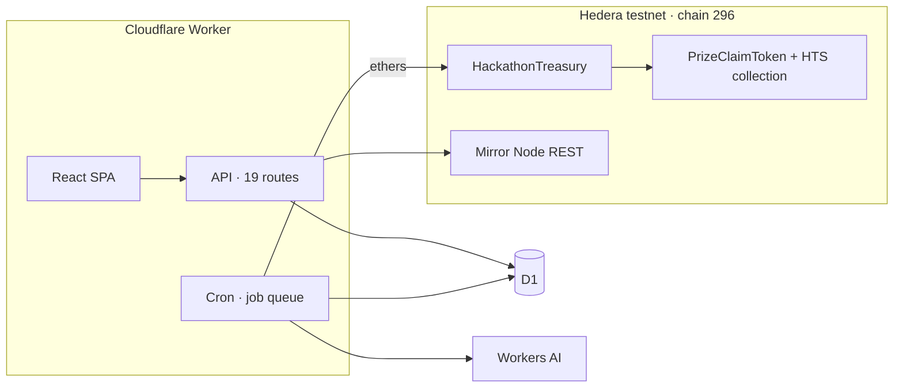

# JudgeBuddy

**The verifiable decision-and-payout layer for ecosystem programs.** AI agents rank each
submission and attach the evidence. A Hedera contract holds the prize funds, pays the
winners and keeps the record.

- **Live app:** https://judge-buddy.l17s.dev
- **Treasury on HashScan (testnet):** https://hashscan.io/testnet/contract/0xd93128FEE6773F552F5EC67FDddD3c1fa882fd69
- **Showcase + demo video:** https://ethglobal.com/showcase/judgebuddy-nje6q

## The loop

1. **Submission arrives** — repo, demo URL, deployed contracts, track.
2. **Evidence is gathered** — live checks against the GitHub API, the demo URL and HashScan.
   A dead link fails the rule; a rate-limited source retries instead of failing silently.
3. **Agents score and group** — four agents (eligibility, track fit, quality, theme
   grouping) produce a ranked shortlist with a written rationale per project. Every output
   is JSON-schema constrained and stored with the model that produced it.
4. **The decision is anchored** — keccak256 of the full evaluation is written on-chain, so
   a builder can check the rationale they received against the record.
5. **The treasury settles** — awards at or below the organizer's threshold pay out
   automatically. Awards above it need the judge's EIP-712 signature; the contract mints a
   prize-claim NFT the winner redeems for the funds.

## Architecture

One Cloudflare Worker serves the React app, the API and the cron scheduler. D1 holds the
job queue, the event store and the evaluation record. Workers AI runs the scoring agents —
no third-party model key.



The payout rule is a contract invariant, not backend policy: `executeAutonomousPayout`
reverts above the organizer's threshold, `ECDSA.recover` gates the signed path, and
per-track `budget / reserved / paid` accounting guards every transfer. Each signed
approval ships with a Ledger clear-signing manifest, so the signer reads the recipient,
amount, track and expiry in plain language.

## Deployed contracts (Hedera testnet)

| Contract             | EVM address                                  | Hedera ID     |
| -------------------- | -------------------------------------------- | ------------- |
| HackathonTreasury    | `0xd93128FEE6773F552F5EC67FDddD3c1fa882fd69` | `0.0.9798703` |
| PrizeClaimToken      | `0xAc370628C1Ba5d03d5cfB594262daf70cdB5d855` | `0.0.9798699` |
| Payout token (jbUSD) | `0x398cAFe2C8d16BdF6c970D3e251A899A481a0D4D` | `0.0.9797625` |

HTS prize-claim collection: `0.0.9798702` (JudgeBuddy Prize Claim / JBPC), owned by the
PrizeClaimToken contract. Claims are minted to the contract and burned on redemption, so
a winner never has to associate with the collection to be paid.

## Repository layout

| Path         | Contents                                                        |
| ------------ | --------------------------------------------------------------- |
| `src/`       | React app (organizer, submissions and operations surfaces)      |
| `cf/`        | Worker: API routes, agent pipeline, cron, D1 access             |
| `packages/`  | `shared` (ABI, ids, auth) and `ledger-clear-signing` (manifest) |
| `contracts/` | Solidity: treasury, prize-claim token, demo payout token        |
| `hardhat/`   | Contract test suite                                             |
| `scripts/`   | Deploy and demo bootstrap scripts                               |

## Development

```bash
npm install
npm run dev              # Vite dev server
npm test                 # frontend tests (vitest)
npm run test:contracts   # contract tests (hardhat)
npm run build            # SPA build into dist/
npx wrangler deploy      # deploy the Worker
```

Contract deployment and the on-chain demo bootstrap are scripted:
`npm run deploy:treasury:testnet`, then `scripts/bootstrap-demo.cjs` and
`scripts/settle-claim-award.cjs`. Copy `.env.example` to `.env` for the deploy keys; the
deployed Worker takes its configuration from `wrangler.jsonc` vars and `wrangler secret`.

## License

[Apache-2.0](LICENSE)
